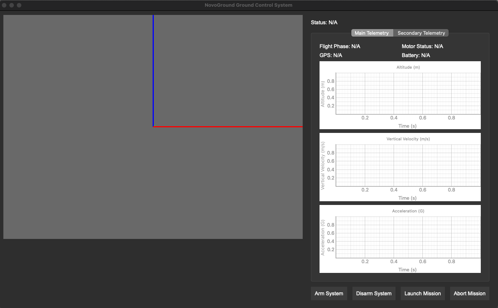

# NovaGround Control System

**NovaGround Control System** is an open-source Ground Control System designed for the NovaGround model rocket.



**NovaGround Control System** is an open-source Ground Control System designed for the Nova model rocket. Leveraging the power of **PyQt** for a sleek user interface and **Panda3d** for real-time 3D rendering, NovaGround provides comprehensive telemetry visualization, mission management controls, and post-mission data analysis. Whether you're a hobbyist rocket enthusiast or an educational project, NovaGround offers the tools you need to monitor and manage your rocket flights with precision and ease.

## Features

- **Real-Time 3D Visualization**: Immerse yourself in a dynamic 3D environment displaying your rocket's trajectory and orientation.
- **Telemetry Dashboard**: Monitor critical flight metrics such as altitude, velocity, and orientation in real-time with intuitive numerical and graphical displays.
- **Mission Control Panel**: Seamlessly manage your rocket missions with easy-to-use controls for starting, pausing, and stopping flights.
- **Data Logging & Playback**: Record all telemetry data during missions for detailed post-flight analysis and replay.
- **Seamless C++ Backend Integration**: Efficiently communicate with the existing C++ backend for robust data acquisition and processing. For more details, visit the [NovaLink project](https://github.com/parkerjbeard/NovaLink).

## Installation

### Prerequisites

- **Python 3.8+**
- **pip** package manager

### Clone the Repository
```bash
git clone https://github.com/parkerjbeard/NovaGround.git
cd NovaGround
```

### Install Dependencies

```bash
pip install -r requirements.txt
```

### Assets Setup

Ensure that the `assets/rocket_model.obj` file is present. If you have a different 3D model, replace the existing one with your model in the same format.

## Usage

### Running the Application

```bash
python main.py
```

### User Interface Overview

- **3D Rocket View**: Visualize your rocket in a 3D grid environment. Rotate, pan, and zoom to get the best view of your flight.
- **Telemetry Dashboard**: Real-time display of key flight metrics such as altitude, velocity, and orientation.
- **Graph Visualization**: Interactive graphs plotting telemetry data over time for in-depth analysis.
- **Mission Control Panel**: Manage your rocket missions with controls to start, pause, and stop flights, as well as toggle data logging.

## Contributing

We welcome contributions from the community! To contribute:

1. Fork the repository.
2. Create a new branch for your feature or bugfix.
3. Commit your changes with clear messages.
4. Submit a pull request detailing your changes.

Please ensure your code adheres to the project’s coding standards and passes all tests.

## License

This project is licensed under the [MIT License](LICENSE).

## Contact

For any inquiries or support, please contact [parkerjohnsonbeard@gmail.com](mailto:parkerjohnsonbeard@gmail.com).
